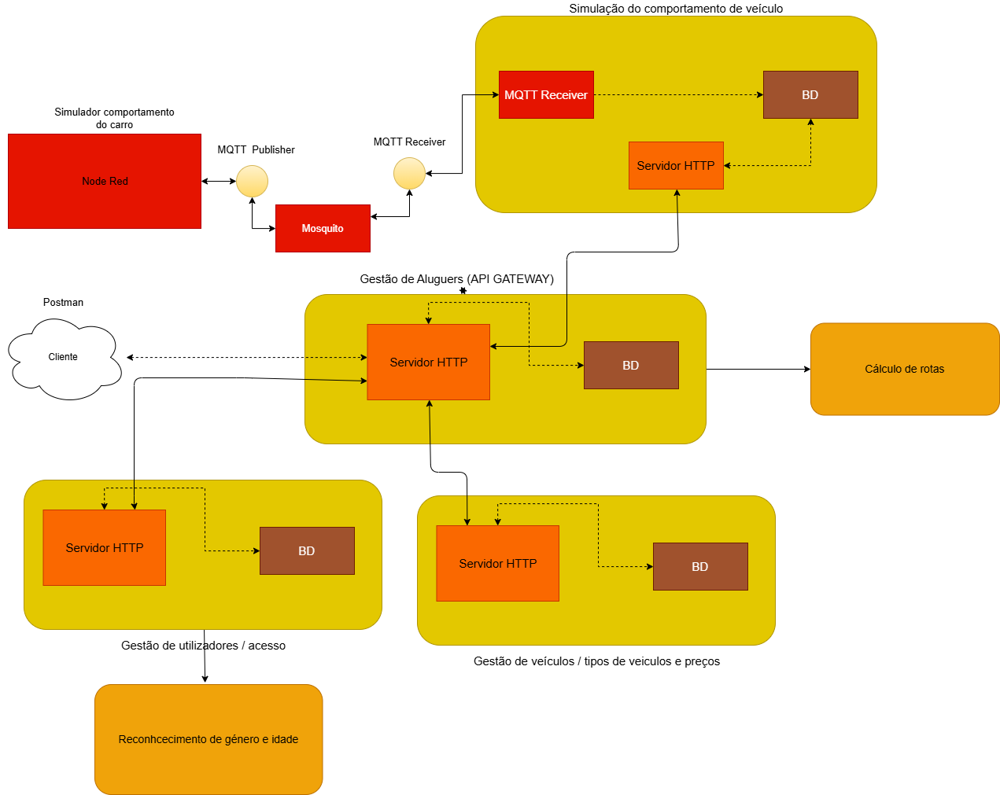

# Systems Architecture Project

Project executed in the context of the systems architecture course unit

## Project Structure

This project was build with 6 major services:

-    RentService (API Gateway):
     > Serviço para registo de aluguers
     > Comunica com o serviço de simulação de viagens
-    AuthService
     > Serviço para registo e respetivo login de utilizadores
     > Comunica com o serviço de reconhecimento de género e idade
-    VehicleService
     > Serviço utilizado para registo de veículos
     > Utilizado para gestão de tipos de veiculos e os seus preço
-    VehicleLocation (Node-Red)
     > serviço que irá registar as posições dos diferentes carros de x em x tempo
     > permitindo com isso simular a viagem de um carro

## Project diagram

